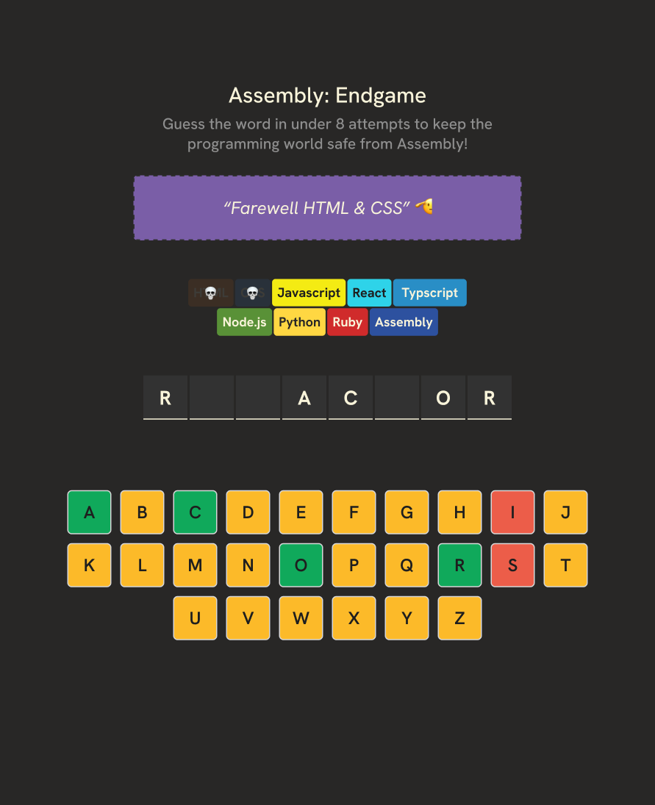

# Assembly Endgame (React Practice)

### React + TypeScript practice project from a tutorial.

## Designs 
#### ➡️ [Link to designs](https://www.figma.com/design/VJNO8MeMT3E0B2twQ1HajU/Assembly--Endgame?node-id=0-1&p=f&t=80ZnmxLRPTLdvZZA-0)

